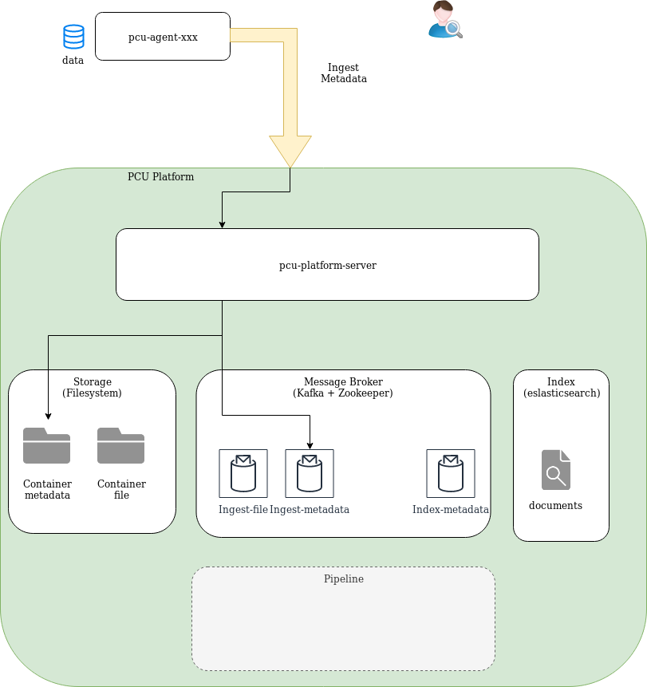
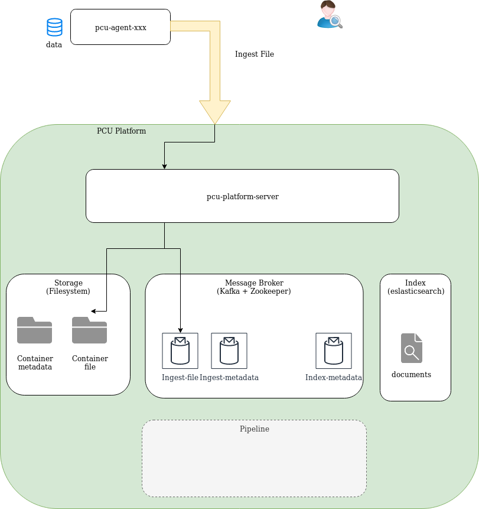
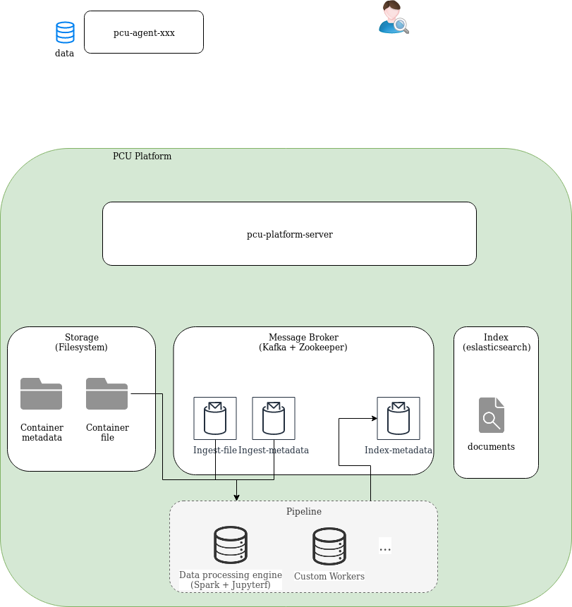
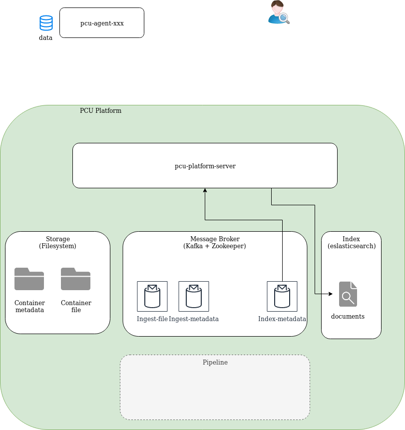
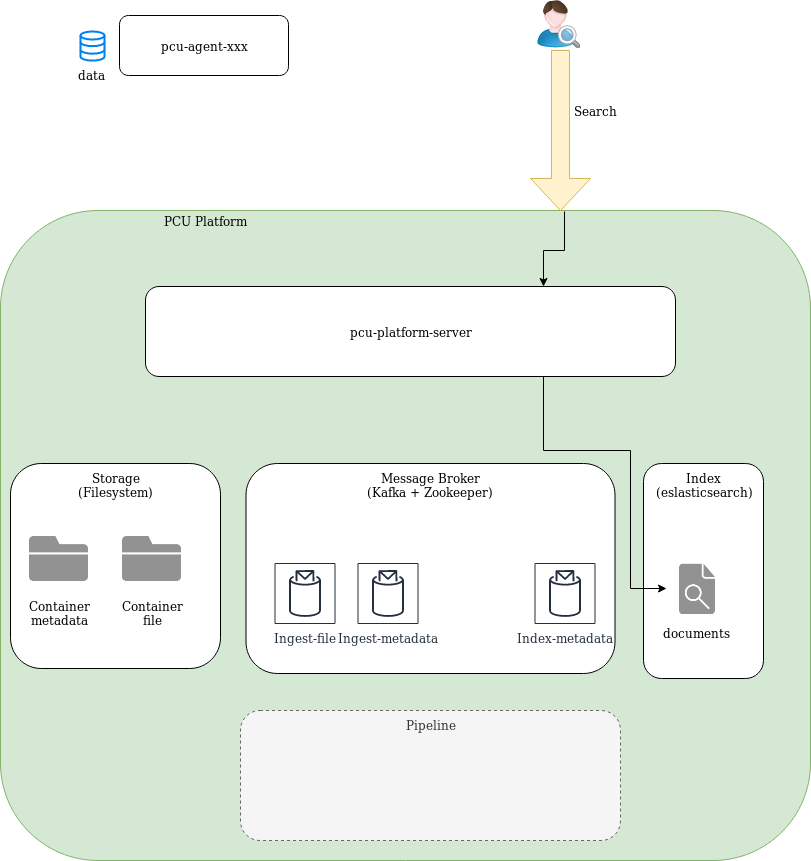

Architecture Technique Applicative de la plateforme PCU
=======================================================

Modules applicatifs
-------------------

Le logiciel PCU mis a disposition contient les modules suivant: 
* [pcu-platform-server](./pcu_platform.md) (serveur applicatif)
* [pcu-client](./pcu_platform.md) (client connecteur au serveur applicatif)
* [pcu-connectors](./pcu_connectors.md) (connecteurs)
  * pcu-index (connecteur aux indexes)
  * pcu-storage (connecteur aux stockage)
* [pcu-collectors](./pcu_agents.md)  (agents de collecte)
  * agent-database-jdbc
  * agent-filesystem-norconex
  * agent-http-norconex

Scénario applicatif principal
-----------------------------

### 1. Ingestion des métadonnées

L'agent de collecte envoie les métadonnées des sources à la plateforme PCU qui les sauvegarde sous forme de fichier JSON dans le stockage et les envoie dans un topic du message broker cible de l'ingestion des métadonnées.

### 2. Ingestion des fichier

L'agent de collecte peut envoyer les petits fichiers binaires (si la source y est adaptée) à la plateforme PCU qui les sauvegarde dans le stockage et les envoie dans un topic du message broker cible de l'ingestion des fichier.

### 3. (Pipeline de traitement des données)

!!! non présent sur le développement courant !!!

Des agent de traitement des données (custom ou script job spark) pilotés par une pipeline consomment et transforment les données (dédoublement, enrichissement, etc) puis les envoie dans le topic du message broker source de l'indexation.

### 4. Indexation des données

Les message du topic du message broker source de l'indexation sont consommés par la plateforme PCU et envoyés dans l'indexe cible définit dans les métadonnées.

### 5. Recherche

Une requête de recherche est envoyée à la plateforme PCU qui la redirige vers le gestionnaire des indexes de recherche pour exécuter la requête.

