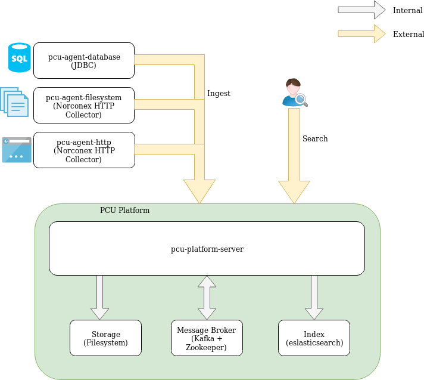
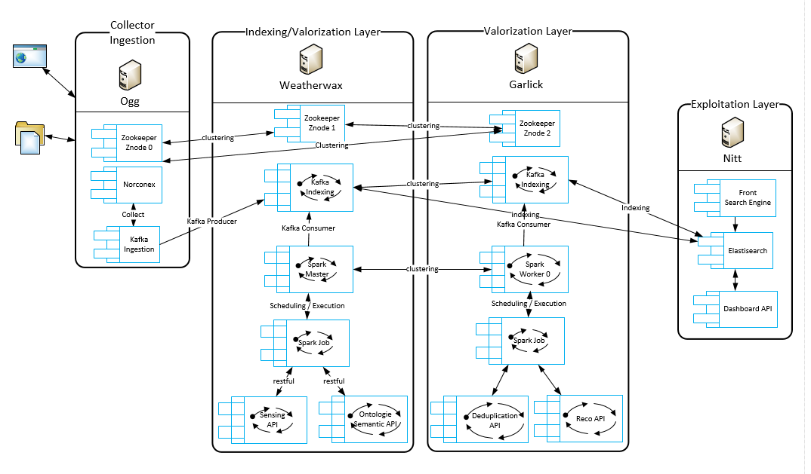
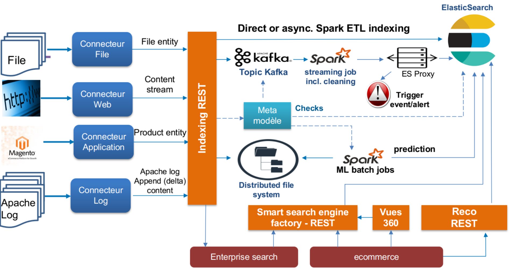

Architecture Globale de la plateforme PCU
=========================================

Architecture globale
--------------------

Le schéma représente l'architecture globale de ce qui est fait à ce jour pour la plateforme PCU dans ce repository.

Modules :
* PCU platform server
* PCU agent de collecte de fichiers filesystem
* PCU agent de collecte web http
* PCU agent de collecte base de données compatibles JDBC

Logiciels :
* Index : Elasticsearch
* Message broker : Apache Kafka

Déploiement
-----------

Le schéma représente l'infrastructure de production prévue pour la plateforme ouverte aux partenaires.

Architecture cible
------------------

