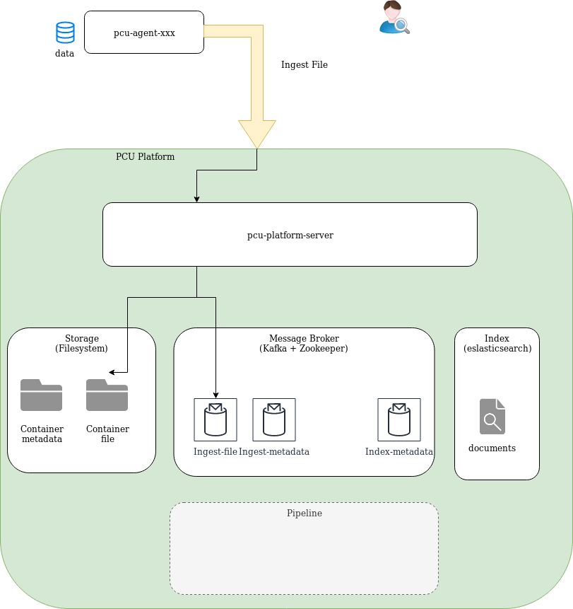
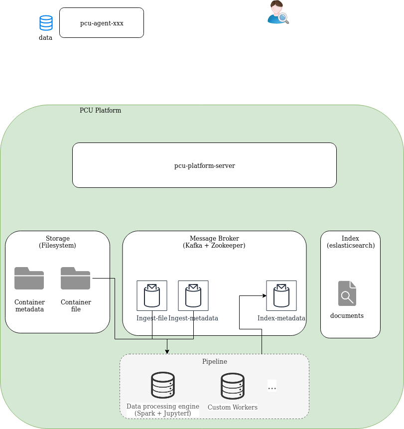
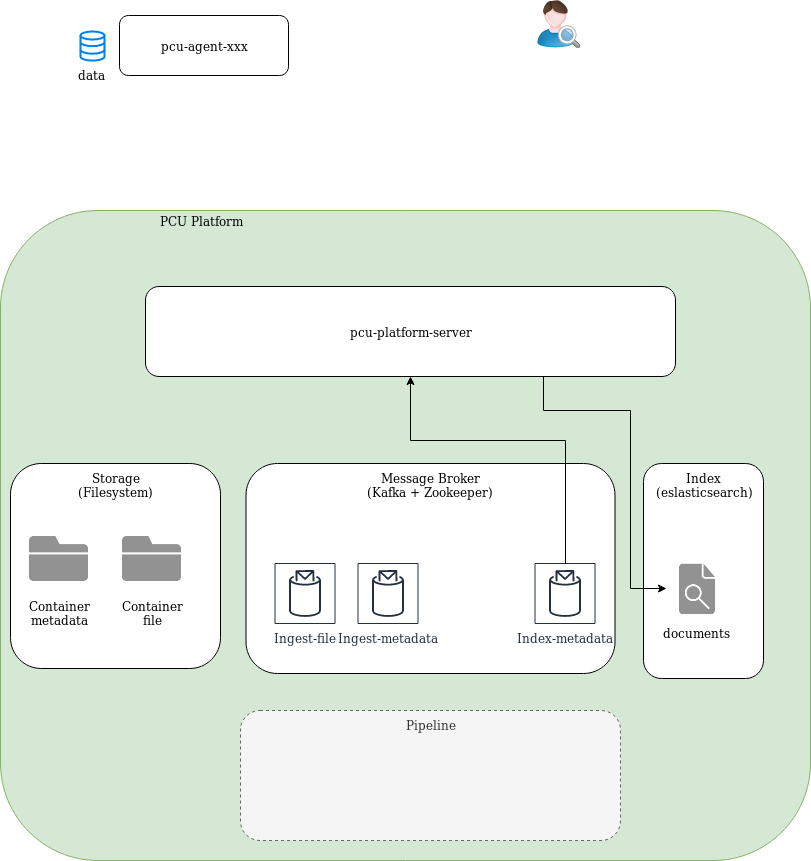

Architecture Globale de la plateforme PCU
=========================================

Architecture globale
--------------------

Le schéma représente l'architecture globale de ce qui est fait à ce jour pour la plateforme PCU dans ce repository.

Modules :
* PCU platform server
* PCU agent de collecte de fichiers filesystem
* PCU agent de collecte web http
* PCU agent de collecte base de données compatibles JDBC

Logiciels :
* Index : Elasticsearch
* Message broker : Apache Kafka

Architecture cible
------------------

TODO recupérer les schémas de la dernière présentation

Scénario principal
------------------

### 1. Ingestion des métadonnées

L'agent de collecte envoie les métadonnées des sources à la plateforme PCU qui les sauvegarde sous forme de fichier JSON dans le stockage et les envoie dans un topic du message broker cible de l'ingestion des métadonnées.

### 2. Ingestion des fichier

L'agent de collecte peut envoyer les petits fichiers binaires (si la source y est adaptée) à la plateforme PCU qui les sauvegarde dans le stockage et les envoie dans un topic du message broker cible de l'ingestion des fichier.

### 3. (Pipeline de traitement des données)

!!! non présent sur le développement courant !!!

Des agent de traitement des données (custom ou script job spark) pilotés par une pipeline consomment et transforment les données (dédoublement, enrichissement, etc) puis les envoie dans le topic du message broker source de l'indexation.

### 4. Indexation des données

Les message du topic du message broker source de l'indexation sont consommés par la plateforme PCU et envoyés dans l'indexe cible définit dans les métadonnées.

### 5. Recherche

Une requête de recherche est envoyée à la plateforme PCU qui la redirige vers le gestionnaire des indexes de recherche pour exécuter la requête.

