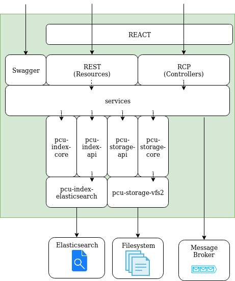

Spécification Technique Détaillée : modules plateforme PCU
==========================================================


pcu-platform-server
-------------------

### Conception



Le module pcu-platform-server (sources/platform/server) sert :
* d'interface d'accès pour les actions venant de l'extérieur vers la plateforme PCU
* d'interface de gestion pour les logiciels internes

Le serveur est développé en SPRING-BOOT et contient également une ihm développée en REACT (sources/platform/server/src/main/frontend).
Il mets à disposition plusieurs API accessibles en http :
* API Rest (classes *Ressource) :
  * ingestion
  * monitoring
  * gestion des indexes
  * gestion des documents
* API RCP (classes *Controller) :
  * recherche
* API de documentation (swagger : http://localhost:8080/swagger-ui.html) 

Le module fait appel à plusieurs connecteurs pour les accès aux logiciels internes :
* Connecteur d'interface aux indexes (sources/connectors/index)
* Connecteur d'interface au stockage (sources/connectors/storage)

#### Ingestion

L'ingestion propose deux points d'API pour d'envoyer des métadonnées et des fichiers binaires. 

* une API d'ingestion des métadonnées qui les enregistre dans un topic "Ingest-Metadata" du message broker et enregistre dans un fichier JSON dans le stockage. Le format attendu des métadonnées  est le suivant :
```json
{
    "index":"nom_index_cible",
    "type":"type_index_cible",
    "id":"id_unique",
    "document" : {
        ...
    }
}
```
* une API d'ingestion des binaires qui envoie une référence dans un topic "Ingest-File" du message broker et enregistre le binaire dans le stockage. Aujourd'hui celui-ci ne supporte que des fichiers de petite taille (<= 2M).

Par défaut l'implémentation du connecteur au stockage est : VFS2 (sources/connectors/storage/vfs2)

Il n'y a pas de mécanisme de "rollback" au niveau des topics en cas d'erreur sur l'enregistrement dans le stockage.

#### Indexation

La fonctionnalité d'indexation permet d'envoyer les données dans les indexes à partir de la pile de messages du topic "Index-metadata". Tout message ajouté dans la pile du topic sera envoyée dans l'indexe définit dans le message.
Par défaut l'implémentation du connecteur aux indexes est : Elasticseach (sources/connectors/index/elasticsearch)

#### Recherche

La fonctionnalité de recherche du serveur ne fait pas de pré-traitement des requêtes de recherche. Il est de la responsabilité du l'implémentation du connecteur aux indexes de définir le format attendu. La seule limite de format du service de recherche est que le contenu de la requête doit être au format JSON.
Par défaut l'implémentation du connecteur aux indexes est : Elasticseach (sources/connectors/index/elasticsearch)

#### Monitoring

Le monitoring indique :
* si le serveur pcu-platform-server est up
* les détails de configuration des logiciels dépendants :
  * la configuration du message broker
  * le status du connecteur aux indexes
  * le status du connecteur au stockage


### Configuration

Le module étant basé développé en SPRING BOOT, le fichier "application.properties" (ou tout autre équivalent cf documentation SPRING BOOT). Celui-ci doit contenir :
* configuration du connecteur aux indexes :
  * **pcu.index.class** : nom complet de la classe d'implémentation du connecteur aux indexes utilisé par le serveur  *(exemple : org.pcu.connectors.index.elasticsearch.PcuESIndex)*
  * **pcu.index.file** : fichier de configuration du connecteur aux indexes utilisé par le serveur, doit être dans le classpath *(exemple : pcuindex.json)*
* configuration du connecteur au stockage :
  * **pcu.storage.class** : nom complet de la classe d'implémentation du connecteur au stockage utilisé par le serveur  *(exemple : org.pcu.connectors.storage.vfs2.PcuVfs2Storage)*
  * **pcu.storage.file** : fichier de configuration du connecteur au stockage utilisé par le serveur, doit être dans le classpath *(exemple : pcustorage.json)*
* configuration des fonctionnalité du serveur :
  * **ingest.container.name.metadata** : nom du conteneur pour les métadonnées issues de l'ingestion des métadonnées dans le stockage *(exemple : ingestMetadata)*
  * **ingest.container.name.file** : nom du conteneur pour les références fichiers issues de l'ingestion du fichier dans le stockage *(exemple : ingestFile)*
  * **ingest.topic.metadata** : nom du topic pour les évènements d'ingestion des métadonnées *(exemple : Ingest-Metadata)*
  * **ingest.topic.file** : nom du topic pour les évènements d'ingestion du fichier *(exemple : Ingest-File)*
  * **index.topic.metadata** : nom du topic pour les évènements à l'origine de l'envoi des données dans l'indexes *(exemple : Index-Metadata)*
* Configuration du message broker (kafka) :
  * **spring.kafka.consumer.group-id** : identifiant du groupe de consommateur pour Kafka *(exemple : pcu-platform)*
  * **spring.kafka.bootstrap-servers** : URL d'accès du serveur kafka *(exemple : localhost:9092)*
  * **spring.kafka.producer.value-serializer** : classe de sérialisation JSON pour la production de messages dans un topic Kafka *(exemple : org.springframework.kafka.support.serializer.JsonSerializer)*
  * **spring.kafka.consumer.value-deserializer** : classe de déserialisation JSON pour la consommation de messages dans un topic Kafka *(exemple : org.springframework.kafka.support.serializer.JsonDeserializer)*
  * **spring.kafka.consumer.properties.spring.json.trusted.packages** : packages contenant les consommateurs de topic Kafka *(exemple : org.pcu.platform)*

TODO gafou > add trusted package default value, serializer and deserialize in code 

pcu-platform-client
-------------------

### Conception

Le module pcu-platform-client est un client java connecteur à l'API du module pcu-platform-server.
Celui-ci est fourni pour une utilisation simplifiée à l'accès de la plateforme. Il utilise la librairie Feign.

### Configuration

La configuration ne contient que l'url du serveur pcu (pcu-platform-server)
